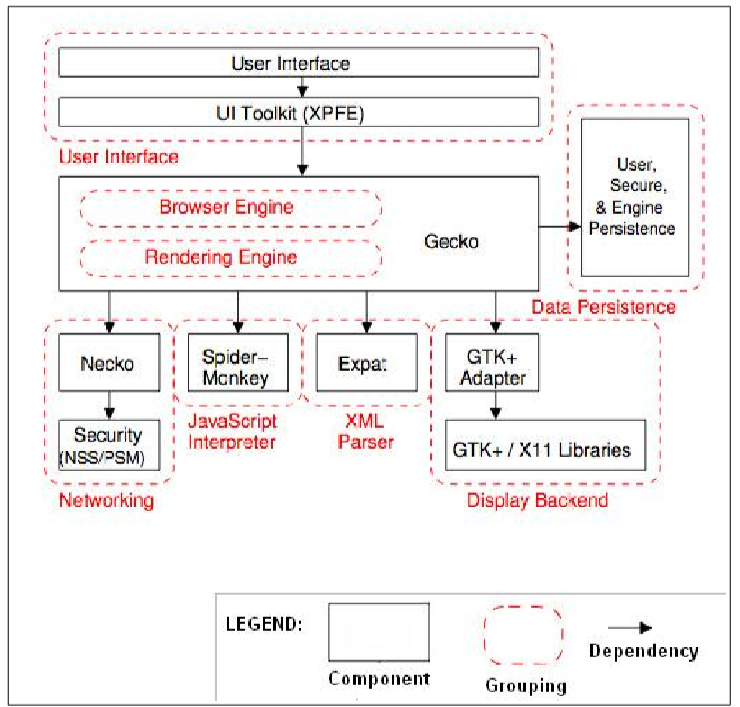

JavaScript fue concebido como una forma de programar sobre el navegador web

Algunos lenguajes de scripting se crearon como lenguajes de propósito general, como Python, pero la mayoría de ellos surgieron como extensiones de herramientas específicas

---

## Ejemplo: Firefox

{width=30%}

<!--  -->

---

## Ejemplo: Firefox

- Gecko: Es el núcleo de Firefox y está escrito en C/C++
	- Tiene un motor Web
	- Y un engine de renderización
- El motor usa un interprete de JavaScript: Spider-Monkey
- El interprete de JavaScript se comunica con Gecko
- Lo que programas en JavaScript afecta al comportamiento del engine de Firefox

## ¿Cómo se consigue?

---

- Hay que crear una API en C/C++ a la que invocar desde JavaScript
- Hay que crear las llamadas en JavaScript que invocan el api en c/C++ para poderlas manejar desde JavaScript
	- Por ejemplo el objeto window sólo puede ser usado en JavaScript cuando estamos en el navegador, no existe en node
	- Tampoco existe DOM en node
	- Porque window y DOM son la API que proporciona Firefox para manejar el engine desde JavaScript

# Otros lenguajes de scripting

## PHP

PHP es un lenguaje de scripting para permitir expandir la funcionalidad del servidor web Apache

Hoy en día se usa como lenguaje de propósito general para crear aplicaciones web
de servidor

---

Su motor, **Zend Engine**, está escrito en C y puede ser usado desde cualquier servidor web como lenguaje de scripting de forma fácil

También se puede extender su funcionalidad escribiendo extensiones en C

## Bash

La consola de comandos Bash, consola principal de los sistemas Linux/Unix, tiene un lenguaje de scripting que permite programar sobre ella

## Python

Python es un lenguaje de propósito general creado para que fuese fácil de aprender y de usar por usuarios con un nivel de alfabetización básico en lenguajes de programación

Necesita un interprete que debemos instalar en el sistema para poder usarlo (similar a node con JavaScript) y se ha usado mucho como sustituto de los lenguajes de scripting clásicos para sistemas operativos como Bash o la consola de MS-DOS/Windows

---

Actualmente el uso de Python se ha extendido enormemente, no sólo como lenguaje de propósito general, si no como lenguaje de __scripting de propósito general__

Es relativamente fácil usar Phyton en de una aplicación en otro lenguaje (típicamente C/C++) por lo que se ha usado como lenguaje de scripting en muchas aplicaciones

Por ejemplo el motor open source **Ogre3D** tiene una versión en la que se usa Python como scripting

[Python en una aplicación](https://docs.python.org/3/extending/embedding.html)

## Python en Blender

Blender es una herramienta de código libre para crear y renderizar objetos 3D

Blender utiliza Phyton como lenguaje de extensión de su herramienta. Con Python se pueden crear macros y extender la funcionalidad de Blender

[Phyton en Blender](https://www.blender.org/api/blender_python_api_2_78a_release/)

---

Internamente Blender utiliza Phyton para crear su interfaz y algunas de sus herramientas internas

Aunque Blender está escrito en C/C++ usa Phyton como lenguaje de scripting para facilitar la creación de macros y add-ons por parte de los usuarios

## Lua

[Lua](https://www.lua.org/) es el lenguaje de scripting más usuado en motores de juegos gracias a su facilidad de vinculación con c/C++ y a su relativa velocidad de ejecución

---

Lua fue expresamente diseñado para ser usado como lenguaje de scripting en otros lenguajes

Hay una gran [lista de juegos que han utilizado Lua como lenguaje de scripting](https://en.wikipedia.org/wiki/Category:Lua-scripted_video_games)

---

Pero también se usa en aplicaciones. Por ejemplo, el reproductor multimedia VLC utiliza LUA para que los usuarios puedan crear sus propias extensiones

[Scripts para VLC en Lua](https://forum.videolan.org/viewforum.php?f=29)

## Luabind

[Luabind](http://www.rasterbar.com/products/luabind.html) es una librería que ayuda a usar Lua desde C++. Simplifica la tarea y permite hacer entre otras cosas:

- Tener clases de C++ en Lua
- Tener funciones y clases de Lua en C++
- Polimorfismo de los métodos de una clase base en C++ desde una clase derivada en Lua


## Lua en Cocos2d-x

Cocos2d-X es uno de los motores más usados para crear juegos para móviles. Su principal ventaja es que es multiplataforma. Se programa en C++ y permite compilar

a Android, Windows 10, IOs etc. Cocos2d-x permite hacer scripting usando LUA, pudiendo programar el juego en LUA llamando al motor desarrollado en C++

[Lua en Cocos2d-x](http://cocos2d-x.org/wiki/Lua)

## Lua en CryEngine

El motor CryEngine de Cryteck utiliza LUA como lenguaje de scripting. Los programadores del engine pueden exponer funciones de sus clases creadas en C++ para que los programadores de scripting en LUA puedan usarlas

[Lua en CryEngine](http://docs.cryengine.com/display/SDKDOC4/Lua+Scripting)

# Ejemplos de uso de JavaScript como lenguaje de extensión

## Introducción

También JavaScript se está comenzado a utilizar como lenguaje de extensión de aplicaciones más allá de los navegadores

## Unity

Unity implementó una versión customizada de JavaScript con tipos para integrarlo en su motor

Apostaron muy fuerte por él al principio, pero los usuarios preferian usar C# en vez de la libre interpretación de Unity de JavaScript

Actualmente la mayor parte del código escrito para Unity está en C# y JavaScript poco a poco va quedando relegado

## Cocos2d-x y Cocos2d-JS

Cocos2D-x soporta no sólo scripting en LUA si no también scripting en JavaScript

[Cocos2d-x JSB](http://cocos2d-x.org/wiki/JavaScript_Binding)


Hay una versión de Cocos2d en JavaScript que es también multiplataforma y que añade soporte para Web: Cocos2d-JS

[Cocos2d-JS](http://cocos2d-x.org/wiki/Cocos2d-JS)

# Usar JavaScript desde C++

---

Como ya has podido deducir, se puede usar JavaScript desde un programa en C++

Tanto [V8](https://github.com/v8/v8/wiki/Getting%20Started%20with%20Embedding) como [SpiderMonkey](https://developer.mozilla.org/en-US/docs/Mozilla/Projects/SpiderMonkey/How_to_embed_the_JavaScript_engine) pueden ser usados en una aplicación en C++

---

Para hacerlo necesitamos el código fuente de V8 y compilarlo junto con nuestro programa. El código fuente podéis
descargarlo aquí [V8 Source Code](https://github.com/v8/v8/wiki/Checking%20out%20source)

Una vez compilado debemos incluir en nuestro programa las cabeceras:

```c
#include "include/libplatform/libplatform.h"
#include "include/v8.h"
```

---

Y crear las estructuras necesarias para cargar el script a ejecutar desde C++ y ejecutarlo

Conseguir que el código JavaScript ejecutado pueda manejar objetos de C++ o que C++ pueda manejar objetos de JavaScript es algo más complicado, pero posible
