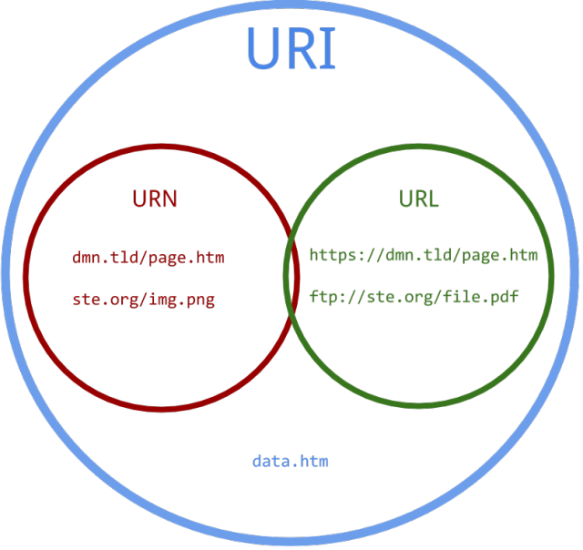

Las URIs son un superconjunto de las URLs.

{height=400px width=400px}

---

Podemos ver la definición de URI en la RFC de *Tim Berners-Lee* [RFC 3986: Uniform Resource Identifier (URI)](https://tools.ietf.org/html/rfc3986)

"Uniform Resources Identifier (URI) es una secuencia compacta de caracteres que identifica un recurso abstracto o físico".

"El nombre de Uniform Resource Locator (URL) es un subconjunto de URIs que además de identificar el recurso, proveen al mismo de una semántica de localización"

Los URNs (Uniform Resource Name) sólo identifican (ej. el nombre de una persona); las URLs también localizan (ej. nos llamamos usando la dirección en la que vivimos).

<!-- Aclararía que las URNs son también un subconjunto de las URIs. Aunque no
hemos hablado de ellas antes y convendría introducirlas en la diapositiva
anterior. -->

---


El directorio especial ../ indica el directorio padre del que se lanzó la aplicación. El directorio ./ indica el directorio
de lanzamiento de la aplicación.

Ejemplos:

* `ftp://rediris.com/resourcea` - URL y URN
* `+34555555555` - URN
* `urn:isbn:0451450523` - URN
* `http://es.wikipedia.org/wiki/Wikipedia:Portada` - URN y URL


---


Cómo se crea una URI:


## Game States

Los estados de Phaser son la unidad mínima que maneja el framework para crear una escena de juego. Podríamos decir que es equivalente a la *Scene* de Unity.

Piensa en un State como en un capítulo de un libro. Pero *sólo un State está activo al mismo tiempo*. Podemos cambiar entre estados, pero sólo uno puede estar activo.

---

<!-- Explicaría más la confusión. Supongo que se quiere hacer hincapié en
que los estados no representan individuos. Haría explícito que esta es la
confusión que se quiere evitar. Creo que toda la explicación que sigue está
muy bien. -->

Es decir no podemos declarar un player state, o un Power Up state. Eso son entidades, no states.

Los states no tiene propiedades de visualización. Los States no son objetos renderizables. Son los objetos del State los que son renderizables.

Los States sirven para controlar el flujo de juego.


---

{width=50%}

## Estructura de un State

---


Un State es un objeto de JavaScript que contiene una serie de métodos ya definidos.


Un estado es válido si hay, al menos, uno de estos métodos: **preload**, **create**, **update** o **render**. Si no existe alguno de estos métodos, Phaser no carga el State.

<!-- Esto es contradictorio. Creo que se ha querido decir que "si no existe
ninguno de estos métodos, Phaser no carga el state". -->

La gestión del State la realiza el **StateManager**. El StateManager es el encargado de gestionar los states. Si no se va a usar un método no es necesario re-declararlo.

---


{width=50%}


---


Además, Phaser proporciona una serie de propiedades que podemos utilizar en nuestro juego,
mayoritariamente, estas propiedades son formas de acceder a los subsistemas de Phaser:

* **game**: La instancia de juego de Phaser.
* **add**: La factoría de GameObject.
* **camera**: La cámara.
* **input**: La entrada de Phaser.
* **load**: el cargador de recursos.

---

* **sound**: el sistema de sonido
* **state**: el StateManager.
* **time**: el manager de tiempo.
* **particles**: el sistema de partículas.
* **physics**: el sistema de físicas.


# Ejemplo básico de un juego con Phaser

---


```html
<!doctype html>
<html>
    <head>
        <meta charset="UTF-8" />
        <title>hello phaser!</title>
        <script src="../phaser/build/phaser.min.js"></script>
    </head>
    <body>

    <script type="text/javascript">
    window.onload = function() {
        // El objeto pasado al final del constructor representa el estado
        // en el que se iniciará el juego.
        var game = new Phaser.Game(800, 600, Phaser.AUTO, '', {
          preload: preload, // carga los recursos del estado.
          create: create    // configura la escena.
        });
```

---

```js
        function preload () {
          game.load.image('logo', 'phaser.png');
        }

        function create () {
            var logo =
              game.add.sprite(game.world.centerX, game.world.centerY, 'logo');
            logo.anchor.setTo(0.5, 0.5);
        }};
    </script>
    </body>
</html>
```

---

Ejemplo de states:

<!-- En mi opinión, este ejemplo es demasiado complicado. Hemos establecido
que los estados del juego son objetos, no funciones pero sin embargo utilizamos
la versión de `add` que acepta una función. Yo lo dejaría en simples
objetos. -->

```js
var boot = function(game){
	console.log("Comenzando el juego", "color:white; background:red");
};
  
boot.prototype = {
	preload: function(){
        this.game.load.image("loading","assets/loading.png");
	},
  	create: function(){
		this.scale.scaleMode = Phaser.ScaleManager.SHOW_ALL;
		this.scale.pageAlignHorizontally = true;
		this.scale.setScreenSize();
		this.game.state.start("Preload");
	}
}
```


---

<!-- Este objeto es muy confuso puesto que se llama como uno de los métodos
del estado. Intentaría buscar un sinónimo. -->

```js
var preload = function(game){}
preload.prototype = {
	preload: function(){
        var loadingBar = this.add.sprite(160,240,"loading");
        loadingBar.anchor.setTo(0.5,0.5);
        this.load.setPreloadSprite(loadingBar);
		this.game.load.spritesheet("numbers","assets/numbers.png",100,100);
		this.game.load.image("gametitle","assets/gametitle.png");
		this.game.load.image("play","assets/play.png");
		this.game.load.image("higher","assets/higher.png");
		this.game.load.image("lower","assets/lower.png");
		this.game.load.image("gameover","assets/gameover.png");
	},
  	create: function(){
		this.game.state.start("GameTitle");
	}
}
```


---


¿Cómo cargamos esto en la página Web?

<!-- No hemos definido el estado gameTitle y el elemento del DOM "game" no
existe. Faltaría hacer un `start` sobre el estado inicial o el setup se habría
hecho para nada. -->

```html
    	<script src="phaser.min.js"></script>
    	<script src="src/boot.js"></script>
		<script src="src/preload.js"></script>
		<script src="src/gametitle.js"></script>
		<script>
			window.onload = function() {
				var game = new Phaser.Game(320, 480, Phaser.CANVAS, "game");
				game.state.add("Boot",boot);
				game.state.add("Preload",preload);
				game.state.add("GameTitle",gameTitle);
			};    
		</script>
```

# Localización de los recursos

<!-- Es de vital importancia que los alumnos aprendan a configurar un servidor
local de donde obtener los recursos. Esta parece la sección ideal puesto que
esto será lo que pase la mayor parte de las veces: que los recursos estarán en
su propio servidor. Explicar CORS es conveniente una vez nos aseguremos que
podemos cargar nuestros propios recursos. -->

---

Para localizar los recursos podemos usar **baseURL** y *crossOrigin* del subsistema load.

**BaseURL** es el lugar donde están los recursos. Si los recursos no están en el mismo sitio que el código
podemos establecer aquí la url base para no tener que escribirla constantemente en el método de carga concreto.

---

**Cross-origin resource sharing (CORS)** es el mecanismo de control y restricción de recursos que emplean los navegadores cuando un
recurso es solicitado por otro dominio. CORS define la forma en la que el navegador debe interactuar con el servidor.

[MDN de Cross Origin](https://developer.mozilla.org/en-US/docs/Web/HTML/CORS_settings_attributes)

---


**anonymous** significa que no hay ningún intercambio de credenciales entre cliente y servidor.

**use-credentials** significa que para acceder al recurso hay que tener credenciales.

Algunos ejemplos:

```js
function preload() {
    game.load.baseURL = 'http://examples.phaser.io/assets/';
    game.load.crossOrigin = 'anonymous';
}
```

```js
function preload() {
    game.stage.backgroundColor = '#85b5e1';

    game.load.baseURL = 'http://examples.phaser.io/assets/';
    game.load.crossOrigin = 'anonymous';
}
```

# Carga de recursos en memoria

<!-- Sería conveniente hacer referencia a la caché. Sobre todo porque
después nos referiremos a ella durante la liberación de recursos. -->

---

<!-- Convendría recordar que esta función es la misma función `preload`
del ejemplo anterior. O proveer de nuevos ejemplos de estados completos.
Personalmente me inclino más por esta última opción. -->

Una vez que tenemos el origen de los recursos podemos cargarlos en memoria.

Se le añade una _key_ (clave o nombre) al recurso para poder identificarlo.

```js
function preload() {
    game.load.baseURL = 'http://examples.phaser.io/assets/';
    game.load.crossOrigin = 'anonymous';

    game.load.image('phaser', 'sprites/phaser-dude.png');
}
```

---

```js
function preload() {
    game.stage.backgroundColor = '#85b5e1';

    game.load.baseURL = 'http://examples.phaser.io/assets/';
    game.load.crossOrigin = 'anonymous';

    game.load.image('player', 'sprites/phaser-dude.png');
    game.load.image('platform', 'sprites/platform.png');
}
```


---


Podemos cargar diferentes recursos como: imágenes, archivos JSON, atlas de texturas, video, sonido, tilemaps...

La función **onLoadComplete** nos informa de la finalización de la carga.

<!-- Creo que esto es una señal, no una función. De todas formas, convendría
aclarar en qué contexto hay que usarlo y proveer un ejemplo preciso. -->

```js
onLoadComplete: function() {
  this.ready = true;
}
```

**isLoading** nos informa de que aún estamos cargando recursos.

<!-- De nuevo, habría que especificar el contexto. En este caso el tipo al
que pertenece la propiedad. -->

# Liberación de recursos

---

Si cambiamos de state y no vamos a volver al mismo, es muy probable que haya recursos que ya no utilizaremos
nunca. En este caso podemos eliminarlos de la caché. Hay que usar la key asignada en la carga.

```js
cache.removeImage(key)
cache.removeXML(key)
```

<!-- Aqué el contexto es muy relevante puesto que no hemos explicado la caché.
Hay que indicar que `cache` es una propiedad del objeto juego. -->

# Sprites en Phaser

---

Son las imágenes 2D que sirven para visualizar los objetos en un juego 2D.  En Phaser se instancian así:

```js
player = game.add.sprite(100, 200, 'player');
```

---

{height=75%}

Hay que usar la key que se le puso en la carga. El objeto, obviamente, debe estar cargado memoria.

# Spritesheet o atlas de sprites

---

{height=300px width=400px}

---

Sirven para optimizar recursos:
* Reduce el número de accesos al servidor (no es lo mismo traerse una imagen grande con muchas imágenes pequeñas que muchas imágenes pequeñas individuales).
* Es más eficiente en memoria.

---

Sirve también para crear animaciones por frames.


```js
function preload() {
    //  37x45 is the size of each frame
    //  Hay 18 frames in the PNG
    game.load.spritesheet(
      'mummy',
      'assets/sprites/metalslug_mummy37x45.png',
      37, 45, 18
    );
}

function create() {
    var mummy = game.add.sprite(300, 200, 'mummy');
    var walk = mummy.animations.add('walk'); //[0, 1, 2, 3, 4, 5, 6, 7, 8, 9, 10, 11, 12, 13, 14, 15 ...]
    mummy.animations.play('walk', 30, true);
}
```

---


