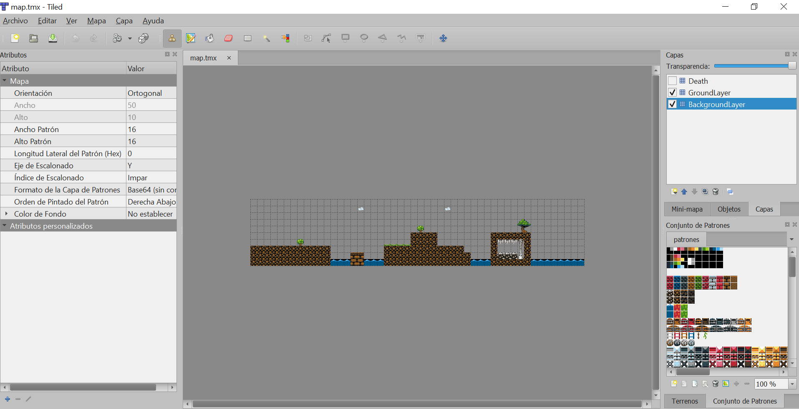
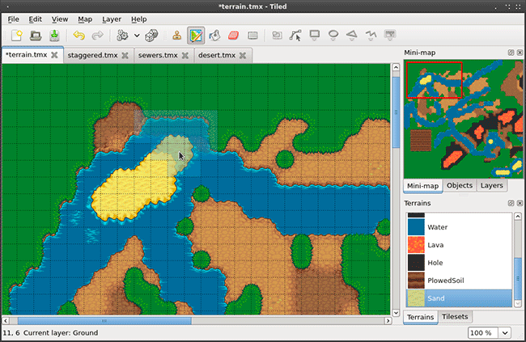
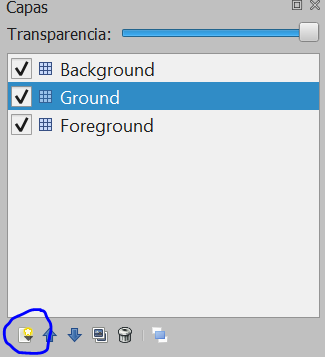

Los tiles simplifican el desarrollo, ya que hacen que el mundo se considere
**una matriz discreta**


---

Los tiles pueden ser usados para dibujar (por ejemplo, el mapa o el fondo), y
también *para la lógica del juego* (como en los
[roguelikes](https://es.wikipedia.org/wiki/Roguelike)).

---


---

Cada *tile* es una imagen particular, independiente

. . .

... o no!


<!-- # Tile sets -->

<!-- ## Qué es un tile set -->

<!-- Un **tile set** es una "hoja" en la que todos los tiles están dibujados, cada -->
<!-- uno en su celda correspondiente -->


<!-- --- -->

<!--  -->

# Tile maps

## Qué es un tile map

Un **tile map** es una simplificación de un mundo en 2D en la que dicho mundo es
dividido en una cuadrícula de tamaño fijo (una matriz 2D)

---

En cada "celda" se pinta un tile, generalmente extraído de un *tile set*

<!-- Cada una de los rectángulos que forman la cuadrícula, en realidad representa un -->
<!-- fragmento o *frame* de un *spritesheet*. -->


## Partes de un tile map

Normalmente un tile map está compuesto por:

- un fichero de datos con la definición del tile map
- su tamaño
- el tamaño de las casillas (tiles)
- una hoja de sprites con todos los tiles disponibles juntos 
- frame concreto que debe visualizarse en cada casilla


## Ejemplo de tile map

{height=75%}


# Tile sets

## Ejemplo de tile set

{height=75%}


---

Esto funciona bien para cosas aisladas: monedas, árboles, cajas...

---

Pero no funciona bien en **la playa**

## La playa


(De <http://opengameart.org/content/happyland-tileset>)


---

Los tiles normalmente están creados para repetirse en la escena
sin que se vean costuras, de forma que se pueden construir escenas muy
complejas 

Se ocupa **mucha menos memoria** que dibujando la
escena en una imagen (se carga una, se usa muchas veces)


## ¿Por qué es más eficiente?

* Escena de 4096x1024p, tiles de 64X64
    * Sin tile map: 4096x1024x4Bytes de color = **16.7MB**
    * Con tile map: tile map de 64x16, tile set de 1024x1024 con 16x16 tiles = 256 tiles
        * Tamaño del tile map = 1024Bytes
        * Tamaño del tile set = 1024x1024x4 = 4 MB
        * Tamaño total = **4.01 MB**

## Otras ventajas:

* Al tener todos los tiles en la misma hoja de scripts sólo necesitamos una Drawcall (llamada a pintado) para pintar todo el escenario
* Cuando cargamos desde Internet, es fundamental reducir los tiempos de carga
  (reducir el tamaño de los archivos ayuda)
<!-- * En HTML5 es importante el peso de los archivos. Los tiempos de carga son mucho mayores que en una máquina local ya que hay que descargarse los datos desde el servidor -->
* Dibujar la escena es más sencillo, sobre todo con un editor de tiles
* Podemos reutilizar tiles en diferentes escenarios.

---

La desventaja es que los gráficos del escenario **están repetidos**

---

(Pero periódicamente se pone de moda)


# Editores de tiles


## ¿Por qué usarlos?

Nos simplifican la edición del tile map enormemente

---

Crear el tile map a mano es mucho mas complejo y propenso a errores


## Tiled

[Tiled](http://www.mapeditor.org/) es un editor de niveles 2D que ayuda a desarrollar escenarios para juegos

---

Puede exportar a diferentes formatos, entre ellos el formato JSON que usa Phaser

---

Tiene soporte para diferentes capas (**layers**) e incluso para añadir una capa
especial de objetos con la ubicación de los objetos en el mapa


## La interfaz de Tiled

{height=75%}


##Partes de la interfaz de Tiled

* Menu contextual (izquierda)
* Tilesets (derecha abajo)
* Layers (derecha arriba)
* Herramientas. (Parte superior)
* Zona de edicion (centro)


## Crear un nuevo proyecto

Creamos un nuevo proyecto en `Archivo` > `Nuevo` y aparecerá la ventana de creación del tile map

{height=75%}

---

Aquí establecemos el tamaño del patrón (tile) y el número de patrones que tendrá el nivel

Si queremos vista ortogonal o isométrica

Marcamos como base64 sin comprimir el formato de la capa de patrones


## Vista ortogonal o isométrica


* Base ortogonal es la tradicional en los juegos 2D (visto "desde arriba")
* Base isométrica es una vista ortogonal especial que simula el 3D sin corrección de perspectiva
    * Todos los ejes forman un ángulo de 120º. El dibujo se gira 45º para poner la esquina del escenario frente al espectador
    * La cámara se situaría en la esquina superior 

---

{height=75%}


## Perspectiva isométrica


{height=75%}


## Perspectiva ortogonal


{height=75%}


## Añadir un tileset


{height=60%}

**El nombre que le demos al tile set** se usará posteriormente para cargar el spritesheet con los tiles en Phaser


## Añadir una capa


Podemos añadir nuevas capas

Las capas son importantes para diferenciar los objetos del fondo con los objetos del suelo

{height=75%}


## Exportar el mapa


Recomendable exportarlo a formato JSON


# Tile maps en Phaser


## Cargar el tile map

Para cargar el fichero de descripción del tile map, usamos `load.tilemap`{.js}


```js
this.game.load.tilemap('tilemap', 'images/map.json', null, Phaser.Tilemap.TILED_JSON);
```

---

- El primer parámetro es el nombre del recurso en la cache
- El segundo es el fichero JSON que contiene la descripción del mapa
- El tercer parámetro (si es distinto de `null`{.js}) deberá contener el objeto JSON del mapa, ignorando el segundo parámetro
- El cuarto parámetro indica el tipo de fichero que puede ser: `Phaser.Tilemap.CSV`{.js} o `Phaser.Tilemap.TILED_JSON`{.js}.


---


Para cargar el atlas de patrones usaremos la carga de imagenes normal: `load.image`{.js}

```js
this.game.load.image('patronesTilemap', 'images/patrones.png');
```


## Crear el tile map

Para crear un tilemap usamos el recurso cargado en la cache como *tilemap*

Una vez creado le asignamos la textura donde tenemos los tiles


```js
this.map = this.game.add.tilemap('tilemap');

this.map.addTilesetImage("patrones","patronesTilemap");
```

---

La textura debe estar previamente cargada y el nombre de la 
textura en el mapa de tiles debe ser conocido

Un mapa de tiles puede tener más de una textura asociada, por lo que hay que asignar al nombre usado en el editor al asignar al tileset al nombre de la textura cargada en la cache


## Crear las diferentes capas

Como hemos visto, en el editor de tiles podemos crear diferentes capas o *layers*

Una capa permite diferenciar los objetos del fondo con los objetos de frente o tener diferentes fondos para realizar "paralax"

---

Si hay capas creadas en el editor, podemos asignar estas capas (*layers*) en Phaser:

```js
this.backgroundLayer = this.map.createLayer("BackgroundLayer");
this.groundLayer = this.map.createLayer("GroundLayer");
this.foreground = this.map.createLayer("Foreground");
```

## Re-escalar el tile map.

Normalmente los tiles están a resoluciones bajas si queremos tener apariencia
de juego retro de 8 o 16 bits

Así, los tiles muy pequeños en una resolución normal actual

---

La solución es escalarlos. Se pueden escalar de forma
manual usando `setScale`{.js}

```js
      this.groundLayer.setScale(3,3);
      this.backgroundLayer.setScale(3,3);
      this.death.setScale(3,3);
```

---

Se pueden escalar de forma automática usando `resizeWorld`{.js}

Con `resizeWorld`{.js} es muy recomendable que la resolución de pantalla sea
proporcional a la resolución del tile map para que se adapte correctamente en
altura y en anchura

```js
this.backgroundLayer.resizeWorld();
```

