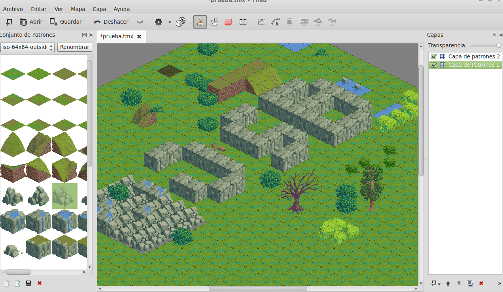
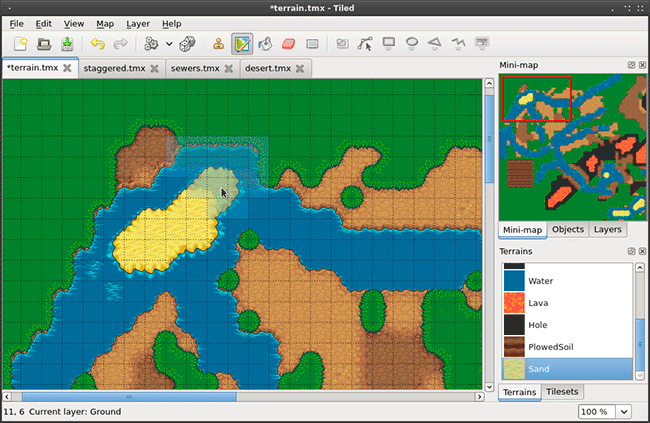
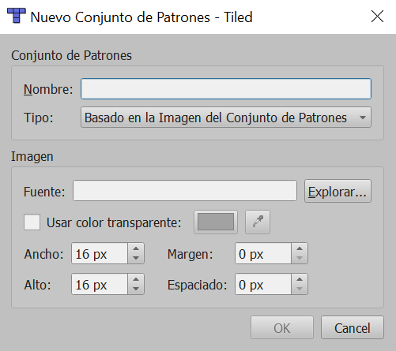
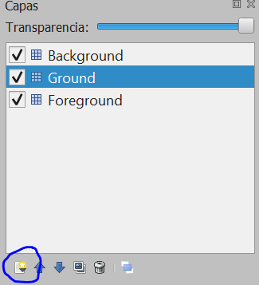

Aquí establecemos el tamaño del patrón (Tile) y el número de patrones que tendrá el nivel.

Si queremos vista ortogonal o isométrica.

Marcamos como base64 sin comprimir el formato de la capa de patrones.

##Vista ortogonal o isométrica.


* Base ortogonal es la tradicional en los juegos 2D.
* Base isométrica es una vista ortogonal especial que simula el 3D sin corrección de perspectiva.
* Todos los ejes forman un ángulo de 120º. El dibujo se gira 45º para poner la esquina del escenario frente al espectador.
* La camara se situaría en la esquina superior 

---

{height=75%}


##Perspectiva isométrica


{height=75%}


##Perspectiva ortogonal


{height=75%}


##Añadir un tileset


{height=75%}

OJO!!! el **nombre que le demos al tileset** se usará posteriormente para cargar el spritesheet con los tiles en phaser ya que no se carga automáticamente.


##Añadir una capa


Podemos añadir nuevas capas. Las capas son importantes diferenciar los objetos del fondo con los objetos del suelo.

{height=75%}


##Exportar el mapa.


Recomendable exportarlo a formato JSON.


#Usar TileMaps en Phaser


##Cargar el TileMap

Para cargar el fichero de descripción del tilemap, usamos **load.tilemap**. El primer parámetro es el nombre del recurso en la cache. El segundo es el fichero json
que contiene la descripción del mapa. El tercer parámetro si es distinto de **null** deberá contener el objeto json del mapa, ignorando el segundo parámetro y por último
el cuarto parámetro indica el tipo de fichero que puede ser: **Phaser.Tilemap.CSV** o **Phaser.Tilemap.TILED_JSON**.

```js
this.game.load.tilemap('tilemap', 'images/map.json', null, Phaser.Tilemap.TILED_JSON);
```

---


Para cargar el atlas de patrones usaremos la carga de imagenes normal: **load.image**.

```js
this.game.load.image('patronesTilemap', 'images/patrones.png');
```


##Crear el TileMap

Para crear un tilemap usamos el recurso cargado en la cache como *tilemap* y una vez creado le asignamos la textura donde tenemos los tiles. La textura debe estar previamente cargada y el nombre de la 
textura en el mapa de tiles debe ser conocido, ya que un mapa de tiles puede tener mas de una textura asociada, por lo que hay que asignar al nombre usado en el editor al asignar al tileset al nombre de la textura cargada en la cache.

```js
this.map = this.game.add.tilemap('tilemap');

this.map.addTilesetImage("patrones","patronesTilemap");
```


##Crear las diferentes layers.

Como hemos visto, en el editor de tiles podemos crear diferentes layers. Una layer permite diferenciar los objetos del fondo con los objetos de frente o tener diferentes fondos para realizar "paralax".

Si hay layers creadas en el editor, podemos asignar estas layers en Phaser:
```js
this.backgroundLayer = this.map.createLayer("BackgroundLayer");
this.groundLayer = this.map.createLayer("GroundLayer");
this.foreground = this.map.createLayer("Foreground");
```

##Reescalar el TileMap.

Normalmente los tiles estan a resoluciones bajas si queremos tener apariecia de juego retro de 8 o 16 bits. Por lo que los tiles serian muy pequeños en una resolución normal actual. La solución es escalarlos. Se pueden escalar de forma manual usando **SetScale**.
```js
      this.groundLayer.setScale(3,3);
      this.backgroundLayer.setScale(3,3);
      this.death.setScale(3,3);
```

---

Se pueden escalar de forma automática usando **resizeWorld**. Si usais resizeWorld, es muy recomendable que la resolución de pantalla sea proporcional a la resolución del tilemap para que se adapte correctamente en altura y en anchura.

```js
this.backgroundLayer.resizeWorld();
```

#Texto en Phaser


## Crear Texto usando fuentes del sysema.

Para crear texto simplemente podemos usar la entidad Text con la factoría de Phaser *add.text*.


---

Pero podemos modificar los atributos de text para cambiar su aspecto como:

* alin: alineación del texto.
* font: tipo de letra.
* fontSize: tamaño.
* fontWeight: si queremos negrita o no.
* stroke: color del borde.
* fill: color de relleno.
* strokeThickness: grosor del borde.

---

```js
var text = game.add.text(game.world.centerX, game.world.centerY, '- phaser text stroke -');

// alineación del texto
text.anchor.set(0.5);
text.align = 'center';

// Font style
text.font = 'Arial Black';
text.fontSize = 50;
text.fontWeight = 'bold';

//Color del reborde de la letra y grosor.
text.stroke = '#000000';
text.strokeThickness = 6;
text.fill = '#43d637';
text.setShadow(5, 5, 'rgba(0,0,0,0.5)', 5);
```

##Problema de las fuentes del sistema


Que una fuente de nuestra máquina puede no estar disponible en la máquina del usuario. ¿Solución? Usar fuentes estandar, crear nuestras propias fuentes de bitmaps o usar fuentes Web como Google Fonts.


## Texto con Bitmap fonts.

Para cargar un bitmapfont hay que usar **load.bitmapFont** en el preload donde hay que pasarle el png con las fuentes y el xml que las describe.

load.bitmapFont

Para generar el xml y el bitmap podemos usar Litera que es online
[Littera](http://kvazars.com/littera/)

O BMFont para windows
[Bmfont](http://www.angelcode.com/products/bmfont/)

```js
preload: funciton(){
    game.load.bitmapFont('bitmapFont', 'assets/fonts/bitmapFonts/bitmapFont.png', 
	'assets/fonts/bitmapFonts/bitmapFont.xml');
}
create: function(){
text = game.add.bitmapText(200, 100, 'bitmapFont','Bitmap Fonts!',64);
}
```


## Texto con fuentes Web.

Podemos cargar fuentes desde la web, por ejemplo Google Font. Para ello hay que cargar la fuente previamente antes de usarla.

Podemos cargar el javascript de Google Font previamente en la página.
```html
<script src="//ajax.googleapis.com/ajax/libs/webfont/1.5.18/webfont.js"></script>
```
O podemos cargarlo desde phaser.
```js
 game.load.script('webfont', '//ajax.googleapis.com/ajax/libs/webfont/1.4.7/webfont.js');
```

---


Hay que esperar a que la fuente sea cargada para poder usarla, para ello podemos definir el siguiente objeto
que le dice al api de Google font que fuente hay que cargar y a que método hay que llamar cuando termine. WebFont es el objeto js de Google cargado:

```js
var wfconfig = {
// el método que invoca Google font al terminar de cargar la fuente.
    active: function() { 
        console.log("font loaded");
        init(); //llamada al método de creación de Phaser.
    },
 
    google: {
        families: ['Sniglet'] //la fuente o fuentes a cargar
    }
 
};

window.onload = function() {
	WebFont.load(wfconfig); //carga la fuente definida en el objeto anterior.
};
```

---


Y luego para usarlo simplemente se cambia el estilo del font.
```js
var textStart = this.game.add.text(0, 0, "Hola mundo!");
textStart.font = 'Sniglet';
```

##¿Problemas de las Google Fonts u otras fuentes Web?

Que dependemos de ellas para que el juego funcione y no tenemos control sobre ellas.
