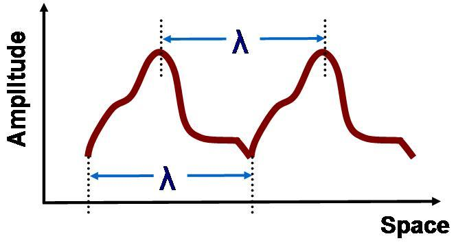
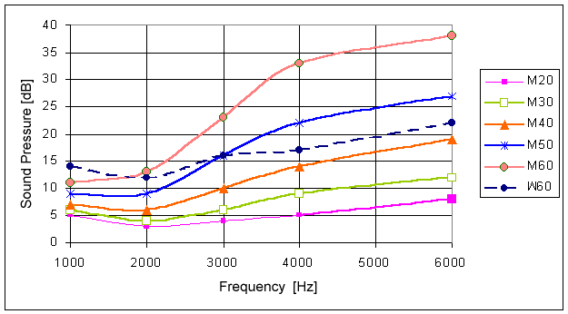

Lo que llamamos sonido es el resultado de:

#. la vibración del aire, que llega a nuestro oreja (esto es una [onda mecánica](https://es.wikipedia.org/wiki/Onda_mec%C3%A1nica))
#. La oreja, gracias a su forma, hace que la onda rebote y se refleje en la dirección del conducto auditivo
#. Así, la onda llega al tímpano, que vibra
#. La vibración es transmitida al [nervio auditivo](https://es.wikipedia.org/wiki/Nervio_vestibulococlear).
#. El nervio llega a nuestro cerebro
#. Ocurren muchas cosas (muchas de las cuáles aún ignoramos)
#. Percibimos, conscientemente, el **sonido**


## Caracteristicas de una onda

La longitud de onda (simbolizada por **λ**)  es la distancia entre dos crestas o valles seguidos.

El periodo **T** es el tiempo requerido para que el movimiento de oscilación de la onda describa un ciclo completo


---

La frecuencia **f** es el número de ciclos completos transcurridos en una unidad de tiempo. (ej: Segundos). 

Hercio (Hz) es el número de veces que se repite una onda por segundo. 100 kHzs => 100.000 veces por segundo.

---

La amplitud de la onda es la altura de la cresta.





## ¿Cómo producir sonido?

---

Para reproducir sonido es necesario generar ondas que se propaguen a través de
un fluido

---

Para hacer esto en un dispositivo moderno, tenemos que **enviar señales a un
altavoz**

---

Para comunicarnos con el altavoz, usamos generalmente un *chip de audio*

---

En general:

#. creamos la representación de una onda compleja (muchos números
reales)
#. le mandamos esta representación **digital** al chip
#. el chip la convierte en una señal electrónica **analógica**
#. le señal eléctrica hace que el altavoz "mueva" el aire, produciendo el
sonido

## ¿Y qué tiene que ver eso con un MP3?

---

Un archivo de audio en formato de onda (hay otros diferentes, como MIDI) tiene
esa representación numérica/digital de la onda compleja que define el sonido

---

El reproductor de audio puede tener que preprocesar el audio que hay en el
archivo. Por ejemplo, para **descomprimirlo** (como en el caso de MP3)

Después, se comunica con el chip de audio, "entregándole" (a
través de varias capas software y hardware) la música en onda "bruta"

---

Hay que tener en cuenta que
el sonido **puede ocupar mucho espacio**


Cuanta más fidelidad queramos reproducir, más precisión (*resolución*)
necesitaremos almacenar

Es decir, más **números**

---

Cuando la precisión es muy grande, el archivo de audio puede tener un tamaño de
varias decenas de megas para una canción de 2 o 3 minutos

Por tanto, usamos **compresión**

---

Cuando usamos compresión, tenemos dos familias de formatos:

- formatos sin pérdida: el audio, al comprimir y descomprimir, no pierde datos.
  Es el mismo
- formatos con pérdida: el audio, al ser comprimido, pierde fidelidad. Pero,
  generalmente, esta pérdida no se nota por el oyente, y la compresión es mucho
  mayor (MP3)

<!-- ## ¿Como se comprime el audio? -->

<!-- Compresión sin pérdida (se comprime y descomprime sin perder información, como -->
<!-- en un fichero `zip`). Busca redundancias en la información para comprimirlas -->

<!-- Compresión con pérdida (MP3). La pérdida de información no sea perceptible. -->

---




Frecuencia media audible 2KHz - 4 KHz 


---


Ejemplo tono no audible para adultos

[Tono no audible adultos](https://www.youtube.com/watch?v=Ez93oblQAJg)

Comprimir consiste en eliminar las frecuencias no audibles.


# Música y sonido

---

Toda la música es sonido

---

En general, asumimos que la música es sonido con ciertas propiedades (armonía,
estructura...)

---

En términos técnicos, es muy normal representar la música y el sonido de
maneras diferentes

---

Generalmente, la música en un videojuego se reproduce de forma **continua** como elemento
decorativo

Los sonidos se lanzan y se espera que estén perfectamente **sincronizados** con la
acción que los lanzan

---

Es muy normal que, como recursos, los archivos de audio estén en formatos sin
compresión y sean cortos

---

La música, normalmente, está codificada como pistas. De la misma forma que
solemos escucharla en reproductores modernos (MP3)


# Reproducir audio en un navegador

---

Hoy en día las tecnologías web permiten reproducir audio desde el navegador 

## Elemento `<audio>`{.html}

```html
<audio controls>
  <source src="https://upload.wikimedia.org/wikipedia/en/4/45/ACDC_-_Back_In_Black-sample.ogg" type="audio/ogg">
  Tu navegador no soporta audio
</audio>
```

<audio controls>
  <source src="https://upload.wikimedia.org/wikipedia/en/4/45/ACDC_-_Back_In_Black-sample.ogg" type="audio/ogg">
  Tu navegador no soporta audio
</audio>

# Web Audio

---

Web Audio es una forma (aún experimental) de reproducir audio en el navegador a
bajo nivel

---


Con Web Audio, podemos crear nuestra propia onda de sonido

```js
// Creamos un "contexto"
var context = new AudioContext();
// Creamos un oscilador (genera una onda sencilla)
var oscillator = context.createOscillator();
// Conectamos el oscilador con los altavoces
oscillator.connect(context.destination);
// Empezamos la reproducción
oscillator.start(context.currentTime);
// Finalizamos la reproducción 5 segundos después
oscillator.stop(context.currentTime + 5);
```


<script type="text/javascript">
function play() {
    var context = new AudioContext();
    var oscillator = context.createOscillator();
    oscillator.connect(context.destination);
    oscillator.start(context.currentTime);
    oscillator.stop(context.currentTime + 5);
}
</script>

<button onclick="play()">Ejemplo de oscilador</button>


---

Web Audio no reemplaza al elemento `<audio>`{.html}

Para reproducir una pista de audio en un archivo estándar, usar una etiqueta
`<audio>`{.html} es generalemente mucho más razonable

---

Web Audio está diseñada de forma que, con la API, construimos nodos 


---

La información de la "onda" se enruta entre los nodos, de forma que encadenamos
procesos

Es muy análogo a un montaje electrónico en el que vamos modificando la onda

---


---

```js
var context = new AudioContext();
var oscillator = context.createOscillator();
oscillator.start(context.currentTime);
oscillator.stop(context.currentTime + 5);
// Creamos un nodo nuevo de ganancia
var gainNode = context.createGain();
// Conectamos la salida del oscilador al nodo de ganancia
oscillator.connect(gainNode);
// Conectamos el nodo de ganancia a la salida
gainNode.connect(context.destination);
// Cambiamos el volumen
gainNode.gain.value = 0.5;
```


<script type="text/javascript">
function play2() {
    var context = new AudioContext();
    var oscillator = context.createOscillator();
    // oscillator.connect(context.destination);
    oscillator.start(context.currentTime);
    oscillator.stop(context.currentTime + 5);
    var gainNode = context.createGain();
    oscillator.connect(gainNode);
    // Connect the gain node to the destination.
    gainNode.connect(context.destination);
    gainNode.gain.value = 0.5;
}
</script>

<button onclick="play2()">Ejemplo de oscilador con nodos</button>


# Referencias y tutoriales

---

- [Getting Started with Web Audio API](https://www.html5rocks.com/en/tutorials/webaudio/intro/)
- [La Web Audio API: Crea Tu Propio Sintetizador Web](https://code.tutsplus.com/es/tutorials/the-web-audio-api-make-your-own-web-synthesizer--cms-23887)
- [Web Audio API: Why Compose When You Can Code?](https://www.toptal.com/web/web-audio-api-tutorial)
