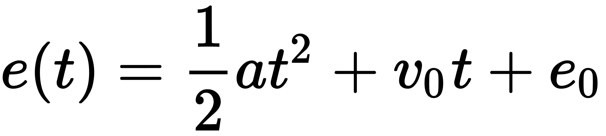
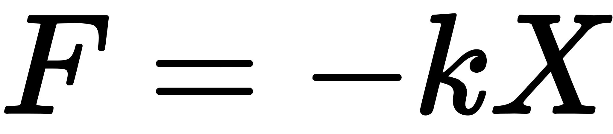

P2 permite crear colisiones físicas mucho más complejas

Aquí no nos restringimos a unos cuantos tiles que aproximan el objeto como lo que hemos visto en el Ninja engine

Podemos ajustar muchísimo más los bounding boxes de forma que podemos adaptarlos a la forma del sprite

---


---

## Editor de físicas

Estas aproximaciones a la forma del sprite no las hace Phaser automáticamente, por lo que debemos crearlas a mano

Existen muchos editores de física 2D, pero uno de los más usados es [**PhysicsEditor**](https://www.codeandweb.com/physicseditor)

---


## Physics Editor

Permite exportar a múltiples formatos: Unity, Cocos2d, Flash, Corona

En concreto Lime + Corona (JSON) también permite exportar a Phaser ya que es compatible Corona (JSON)

Esto genera un JSON con la descripción de los cuerpos físicos. Los antiguos bounding boxes ahora se convierten en **Shapes**


## Iniciar P2 Engine

```js
game.physics.startSystem(Phaser.Physics.P2JS);
```

---


## Cargar los poligonos en la física

Para añadir la descripción de la física a la cache usamos `load.physics`{.js}

```js
game.load.physics('physicsData', 'assets/physics/sprites.json');
```

---

[Ejemplo de colisiones con P2](https://phaser.io/examples/v2/p2-physics/contact-events)

---

Para añadirle una shape a un sprite `loadPolygon`{.js}

```js
sprite = game.add.sprite(100, 200, 'Mario');
sprite.body.clearShapes();
sprite.body.loadPolygon('physicsData', 'Mario');
```

---

## Añadir un cuerpo a la física y depuración

`enable`{.js} permite añadir cuerpos a la física

El segundo atributo si está a `true`{.js} muestra la información de la forma del collider

```js
game.physics.p2.enable(ship, false);
```

---

## Activar los eventos de colisión

Sin ello, la física no generará eventos

```js
game.physics.p2.setImpactEvents(true);
```

---

## Chequear colisiones

Para chequear los diferentes eventos de colision de un objeto (`onBeginContact`{.js}, `onEndContact`{.js}) accedemos a su body físico y cargamos el evento con `add`{.js}

---

```js
block.body.onBeginContact.add(blockHit, this);
block.body.onEndContact .add(blockHitEnd, this);

function blockHit (bodyA, bodyB, shapeA, shapeB, equation) {}

function blockHitEnd (bodyA, bodyB, shapeA, shapeB) {}
```

- `bodyA`{.js} y `bodyB`{.js} son los cuerpos que colisionan
- `shapeA`{.js} y `shapeB`{.js} son sus colliders
- `equation`{.js} array con los puntos de contacto

---

## Grupos de colisión

---

Permite especificar qué tipos de objetos colisionan con cuales y que evento lo procesará

```js
var playerCollisionGroup = game.physics.p2.createCollisionGroup();
var pandaCollisionGroup = game.physics.p2.createCollisionGroup();

panda.body.setCollisionGroup(pandaCollisionGroup);
ship.body.setCollisionGroup(playerCollisionGroup);

ship.body.collides(pandaCollisionGroup, hitPanda, this);
```

---

```js
function hitPanda(body1, body2) {
    body2.sprite.alpha -= 0.1;
}
```

---

## Física con tilemaps

Establecer los tiles colisionables: `setCollision`{.js}, `setCollisionBetween`{.js}...

```js
 map.setCollisionBetween(1, 12);
```

---

```js
game.physics.p2.convertTilemap(map, layer);
```

Convierte todos los mapas con tiles cuadrados sin tener en cuenta su transparencia

Si queremos ajustar la forma hay que pasar la información del editor de shape a cada tile como hemos hecho anteriormente

---


## Ejemplos con P2

[Ejemplos con P2 Engine](https://phaser.io/examples/v2/category/p2-physics)

---

# Triggers (sensor)

---

Hemos visto colisiones

---

Ahora veremos una variante de las colisiones que denominamos **Triggers**

---

Los triggers son un método muy utilizado en videojuegos para generar eventos durante el juego

---

## ¿Qué es un trigger?

Podemos definir un **trigger** (disparador) como una zona del juego en la que se comprueba que objetos entran y salen de ella, informando de ambos eventos a quienes estén interesados

Normalmente un trigger provoca una invocación a un método asíncrono (evento) asociado a dicho trigger

---

Al concepto de trigger a veces se le denomina **sensor**. Por ejemplo, ese es el nombre que utiliza Box2D

P2 también utiliza el concepto de sensor

---

Para establecer que un collider es un sensor, hay que modificar la shape de la física

```js
sprite.body.data.shapes[0].sensor = true; // Establece que la shape 0 es un sensor
```

o bien

```js
triggerShape = trigger.body.addRectangle(10, 4, 0, -54); //añade un sensor al objeto. Devuelve un shape
triggerShape.sensor = true; // modificamos la shape marcándola como sensor
```

---

Al marcarla como sensor, la shape no colisiona con el resto de la física

Por tanto, al objeto se le puede atravesar sin que se produzcan rebotes

---

Pero podemos seguir escuchando los eventos de contacto

```js
trigger.body.onBeginContact.add(checkSensorsBegin,this);
trigger.body.onEndContact.add(checkSensorsEnd,this);
   
function checkSensorsBegin(bodyA,shapeA,shapeB){
    game.debug.text("Collision detected!", 32, 32);
}

function checkSensorsEnd(bodyA,shapeA,shapeB){
    game.debug.text("Collision left!", 32, 32);
}
```

---

# Velocidad

---

## ¿Qué es la velocidad?
<!-- https://www.codeandweb.com/physicseditor/tutorials/phaser-p2-physics-example-tutorial -->

---

La **velocidad** es una magnitud física vectorial que expresa la distancia recorrida de un objeto por unidad de tiempo

Se puede modificar en Phaser directamente en el body físico

```js
sprite.body.velocity.x
sprite.body.velocity.y
```

---

Si aplicamos una velocidad a un objeto físico este se moverá hacia la dirección indicada con la magnitud indicada

---

## Aplicando fuerzas

---

Una **fuerza** es todo agente capaz de modificar la cantidad de movimiento de un objeto

En física de videojeugos llamamos fuerza a una modificación constante del movimiento de un objeto

---

```js
applyForce(force, worldX, worldY);
applyForceLocal(force, localX, localY);
```

- `force`{.js}: es un vector 2D (Por ejemplo: `[200, 100]`{.js})
- `worldX`{.js}, `worldY`{.js}, `localX`{.js} y `localY`{.js} son los punto a partir del cual se está aplicando la fuerza (si no se especifican se toma el centro del mundo o el centro de masas del objeto)

---

## Aplicando impulsos

Un impulso es una fuerza que se ejerce en un momento puntual pero que cesa y su efecto (la aceleración) sólo ocurre un instante

```js
applyImpulse(impulse, worldX, worldY);
applyImpulseLocal(impulse, localX, localY);
```

- `impulse`{.js}: es un vector 2D (Por ejemplo: `[200, 100]`{.js})
- `worldX`{.js}, `worldY`{.js}, `localX`{.js} y `localY`{.js} son los punto a partir del cual se está aplicando la fuerza (si no se especifican se toma el centro del mundo o el centro de masas del objeto)

---

## Move

- `moveRight`{.js}, `moveUp`{.js}, `moveLeft`{.js}, `moveDown`{.js}
- Mueven el objeto sin necesidad de cambiar la rotación
- `moveForward`{.js}, `moveBackward`{.js}
- Mueven el objeto en la dirección de rotación del mismo. Si queremos girar tendremos que rotar el objeto
- `thrust`{.js}: impulsa el objeto hacia su ángulo de orientación

---

## Gravedad

La gravedad es un tipo de fuerza constante hacia una dirección. Normalmente hacia abajo:

```js
game.physics.p2.gravity.y = 300;
```

---


Podemos modificar la fuerza de la gravedad relativa a cada objeto usando `gravityScale`{.js}:

```js
sprite1.body.data.gravityScale = 1;
sprite2.body.data.gravityScale = 0.5;
sprite3.body.data.gravityScale = 0.25;
```

---

[gravityScale](http://phaser.io/examples/v2/p2-physics/gravity-scale)

---

# Aceleración

---

## ¿Qué es la aceleración?

La aceleración es una magnitud vectorial que nos indica la variación de velocidad por unidad de tiempo

---

## Velocidad uniformemente acelerada

$$v = v_0 + a \times \delta t$$

Donde:

- $v$: velocidad
- $v_0$: velocidad inicial
- $a$: aceleración


---

El desplazamiento:


<!--  -->

$$e(t) = \frac{1}{2} a t^2 + v_0 t + e_0$$

- $e(t)$: posición
- $e_0$: posición inicial
- $t$: tiempo
- $a$: aceleración
- $v_0$: velocidad inicial


---


Una buena aproximación en videojuegos es hacer lo siguiente:

$$e(t+1) = e(t) + v(t) \times t$$

$$v(t+1) = \text{min}(v(t) \times a \times t, v_{max})$$

- $e(t+1)$: Siguiente posicion;
- $e(t)$ : Posición inicial
- $a$: Aceleración
- $v(t+1)$: Velocidad en la siguiente iteración;
- $v(t)$: Velocidad actual
- $v_{max}$: Velocidad máxima

---

## Aceleración instantánea

Si la aceleración es instantanea $\rightarrow$ $v(t) = v_{max}$;

$$e(t+1) = e(t) + v_{max} \times t$$

---

## Aceleración variable

El valor de a puede cambiar en función del tiempo

Por ejemplo en función de cuanto se pulse un gatillo, en función de cuanto se mueva la palanca, en función a una ecuación de aceleración, etc.

---

Veamos un ejemplo de aceleración usando `force`{.js}:

```js
function accelerateToObject(obj1, obj2, speed) {
    var angle = Math.atan2(obj2.y - obj1.y, obj2.x - obj1.x); //Ángulo de un vector (arcotangente)
    obj1.body.rotation = angle + game.math.degToRad(90);  // corrige el ángulo (-p1/2 a pi/2) => (0 a 2pi)
    obj1.body.force.x = Math.cos(angle) * speed; // proyección del ángulo en x * módulo
    obj1.body.force.y = Math.sin(angle) * speed; // proyección del ángulo en y * módulo
}
```

[Aceleración](http://phaser.io/examples/v2/p2-physics/accelerate-to-object)

---

- El ángulo entre dos vectores se calcula con la arcotangente del vector diferencia (destino--origen)
- Si queremos calcular la cantidad de movimiento aplicable a cada componente, debemos proyectar el ángulo a los diferentes componentes
- Se usa `thrust`{.js} para acelerar (al ser un impulso, se aplica la aceleración por física) o force en el caso de los objetos
- La rotación es instantánea (en general no tiene por que serlo)

---

# Constrains

---

## ¿Qué es una constraint?

Una **Constraint** es una restricción al movimiento:

```js
var constraint = game.physics.p2.createDistanceConstraint(sprite1, sprite2, 150);
var constraint1 = game.physics.p2.createGearConstraint(sprite, sprite2, 0, 1);
```

---

- **Distance constraint** afecta a la distancia a la que puede estar un objeto de otro: [Distancia](https://phaser.io/examples/v2/p2-physics/distance-constraint)
- **Gear constraint** afecta a la velocidad de rotación a la que puede girar un objeto con respecto a otro: [Gear](https://phaser.io/examples/v2/p2-physics/gear-constraint)

---

## Joints

---

Son un tipo especial de constraint

Conecta dos cuerpos creando una restricción de rotación

---

Un objeto rota en función del otro

Esto sirve para construir objetos pendulantes como cuerdas o cadenas

Básicamente cualquier sistema donde el movimiento de uno afecte al movimiento del resto en algún grado

---

```js
game.physics.p2.createRevoluteConstraint(bodyA, pivotA, bodyB, pivotB, fuerza);
```

#. Objeto padre
#. Punto de pivote de $A$
#. Objeto hijo
#. Punto de pivote de $B$
#. Fuerza máxima que mantiene a las partes juntas

---

[Chains](https://phaser.io/examples/v2/p2-physics/chain)

---

## Springs

Los **Springs** o muelles sirven para mantener una distancia flexible a un objeto
Los springs siguen la ley de Hooke donde la fuerza $F$:

---

<!--  -->

$F=-k \times X$

- $k$: constante de elasticidad **stiffness**
- $X$: longitud

---

Derivado de esta ley tenemos el movimiento armónico oscilante:

El **damping** es una fuerza que va en dirección contraria al movimiento

La resistencia que hace que el movimiento sea oscilante. Cuanto más estirado esté el muelle, más fuerza de damping se genera

El damping consigue cambiar la dirección del movimiento y como siempre es inverso a este movimiento, lo frena hasta que lo cambia de sentido

---

En Phaser

```js
spring = game.physics.p2.createSpring(bodya, bodyb, 0, 30, 1);
```

---

- **restLength**: la longitud del spring
- **stiffness**: rigidez del spring (costante de elasticidad)
- **damping**: amortiguación (rebote o fuerza contraria al movimiento)

---

[Springs](https://phaser.io/examples/v2/p2-physics/mouse-spring)

---

# Kinematic Body

---

## Cuerpos Kinemáticos Vs Cuerpos Físicos

**Kinematic bodies** son cuerpos que están en la física, pero que queremos mover nosotros por código

Típicamente las plataformas de los juegos de plataforma

También se suelen incluir los enemigos que son controlados por la IA o el player si no modificamos su posición con la física

---

En un juego normal, no queremos usar la física para mover un objeto controlado por el jugador o por la IA ya que esto puede provocar muchos problemas

La física es dificil de controlar y produce errores de redondeo

Lo más razonable para garantizar las mecánicas es moverlo nosotros con la lógica del juego

---

Sin embargo, si que queremos tener colisiones necesitamos que pertenezca a la física de alguna forma

---

## ¿Cómo establecemos un cuerpo *kinematic*?

Podemos modificar la propiedad kinematic de body;

```js
kinematic1.body.kinematic = true;
```

---

## ¿Qué cosas afectan a un *kinematic*?

---

- A un objeto kinemático no le afecta la gravedad
- Ni los impulsos
- Ni las colisiones modifican la velocidad del objeto, es decir un choque impide el paso, pero no modifica la velocidad del objeto, porque la física no puede calcular la velocidad de un objeto kinemático
- Sólo podemos preguntar si hemos colisionado con él
- O si él ha colisionado con algo

---

[Movimientos kinemáticos](https://phaser.io/examples/v2/p2-physics/kinematic-body)